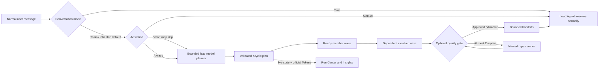

# dsh-agent-team-gui

[English](README.md) | [简体中文](README-zh.md)

[](https://github.com/toolclub/dsh-agent-team-gui/actions/workflows/ci.yml)
[](https://github.com/toolclub/dsh-agent-team-gui/releases)
[](https://github.com/toolclub/dsh-agent-team-gui/stargazers)
[](LICENSE)

**Give DeepSeek Harness a reusable team: one Agent plans, another implements, and a third reviews.**

Save the team once, choose a model for each member, and reuse it across projects and conversations.
Follow the plan, member outputs, retries, and provider-reported Token usage in one Run Center.
This is an unofficial community plugin for the **DeepSeek Harness Web profile**.

[Watch the 80-second UI guide](https://github.com/toolclub/dsh-agent-team-gui/blob/main/assets/promotion-walkthrough-zh.mp4) · [Install v1.1.1](#install) · [Run your first team](docs/first-team.md) ·
[Example recipe](examples/full-stack-delivery.recipe.json) ·
[Share a workflow](https://github.com/toolclub/dsh-agent-team-gui/discussions/1)

[](https://github.com/toolclub/dsh-agent-team-gui/blob/main/assets/promotion-walkthrough-zh.mp4)

*Screenshot-based UI guide with example data and Chinese synthetic narration. Displayed task results, timings, and Tokens are not a live-run benchmark. [Sources and captions](docs/promotion/demo-guide.md).*

If this is useful for your DSH workflow, [give the project a Star](https://github.com/toolclub/dsh-agent-team-gui)
and help another developer discover it.

## Why this plugin

A team is a reusable product object, not a one-off dispatch form. Create it once in **Settings →
Teams**, then use it across projects and conversations.

| Capability | User outcome |
| --- | --- |
| One model and tool policy per member | Combine a planner, implementer, reviewer, or specialist without forcing one route on everyone |
| Dynamic workflow planning by default | The active conversation's model assigns focused work and dependencies from the current request |
| Team / Solo / Inherited modes | Choose a durable conversation override, a project default, or a one-message exception without ambiguous switches |
| Bounded DAG, retries, quality gate, background work | Long work is observable, cancellable, finite, and restart-safe |
| Official provider Token usage | See input, cache-read, cache-write, and output Tokens with full/partial/unavailable coverage—never invented prices |
| Versions, recipes, and definition backup | Reproduce a team, share it without credentials, preview impact, and remap model routes before applying |

## Install

| Plugin release | DSH target | Upgrade guidance |
| --- | --- | --- |
| **1.1.1** | `>=0.1.5-rc.1 <0.1.6-0` | Recommended; fixes tool restrictions, review budgets, dispatch admission, and JSON handoffs |
| 1.1.0 | `>=0.1.5-rc.1 <0.1.6-0` | Initial 0.1.5 compatibility; upgrade the plugin to 1.1.1 |
| 1.0.1 | Verified with `0.1.1-rc.2` | Previous integration; upgrade both DSH and the plugin together |

The walkthrough has [English subtitles](https://github.com/toolclub/dsh-agent-team-gui/blob/main/docs/promotion/demo-captions.en.srt)
and [Chinese subtitles](https://github.com/toolclub/dsh-agent-team-gui/blob/main/docs/promotion/demo-captions.zh-CN.srt).
Load the SRT alongside the existing video in a compatible player; GitHub does not attach it automatically.

Upgrading DSH from 0.1.1? Use plugin **v1.1.1** for DSH **0.1.5**. This release fixes
`source.subscribe` during plugin loading, migrates reconnect and Session APIs, and keeps the existing
team definitions and run store. Restart DSH and refresh the browser after upgrading. The CLI may
report `0.1.5-rc.1` while its compatible internal packages resolve to `0.1.5-rc.2`.

Requirements: a working DeepSeek Harness **Web** profile, at least one configured provider/model,
Node.js `>=22.19.0 <23` or `>=24.0.0`, and pnpm. Declared DSH compatibility is
`>=0.1.5-rc.1 <0.1.6-0`; the v1.1.1 release was verified against DSH `0.1.5-rc.1`.

**Recommended: install the compiled release package.** It includes the built Host and client files,
so installation does not run this plugin's Git `prepare` build or require its `allowBuilds` entry.

```sh
dsh plugin --profile web add -w https://github.com/toolclub/dsh-agent-team-gui/releases/download/v1.1.1/dsh-agent-team-gui-1.1.1.tgz
dsh --profile web
```

Stop and restart an already-running DSH Web process after installing or upgrading. Then open
**Settings → Teams**. If a plugin marketplace chooses Git installation and fails, use the direct
release command above; see [installation troubleshooting](docs/first-team.md#installation-troubleshooting).

[Release notes and checksum](https://github.com/toolclub/dsh-agent-team-gui/releases/tag/v1.1.1) ·
[Git/source installation](#git-source-installation)

> [!TIP]
> If `dsh` is not on `PATH`, use the launcher that starts your working Harness installation.
> With npm, replace `dsh` with `npx @deepseek-ai/dsh@0.1.5-rc.1`; from a source checkout, replace
> it with `pnpm --dir /absolute/path/to/deepseek-harness dsh`. Keep the same launcher for installation
> and startup. New to Harness? Start with its [official setup guide](https://github.com/deepseek-ai/deepseek-harness#run).

Verify that both the `dsh-agent-team-gui` bundle and the `agent-team-gui` configuration row are present:

```sh
dsh --profile web --dump-config
```

## Run your first team

Use the included [full-stack delivery recipe](examples/full-stack-delivery.recipe.json), with a
planner, implementation engineer, and reviewer. You can bind all three to the same working model
for the first run; multiple providers are optional.

1. Download the recipe JSON. Open **Settings → Teams → Recipes & data** and choose **Choose recipe file**.
2. Map the placeholder routes to your configured provider/model routes, review the preview, and choose
   **Create a copy → Import reviewed recipe**. In **Member library**, confirm each member's exact model and tool access.
3. For this first walkthrough, set the imported team's activation to **Run every time** and member selection to
   **All members**, then save. The supplied recipe otherwise uses Smart/adaptive selection.
4. Select an empty scratch project, choose the imported team beside the composer, select **Always use team**, and send the
   [ready-to-copy task](docs/first-team.md#try-a-small-development-task): build and test a small to-do list.
5. Open **Team runs** to inspect the plan, outputs, review, and actual Token coverage. Check the delivered
   files and test results before treating the task as complete.

[Full walkthrough, expected results, and troubleshooting →](docs/first-team.md)

## Create your own team

In **Settings → Teams → Member library**, save each member's role, model, optional fallback, and tool policy.
In **Settings → Teams**, add those members and choose activation, member selection, and execution options.
Leave **Fixed order** off for dynamic planning, or enable it for a fixed serial sequence.
Choose **Team**, **Solo**, or **Inherited** beside the composer to control the current conversation.


*UI example with demonstration data.*

## How orchestration works



With no fixed order, the plugin uses the active conversation's provider/model route in a bounded,
tool-free planner child. It receives the member roles and returns structured assignments plus an
acyclic dependency graph. It does not turn one member into a replacement for the whole team. A
bad, cyclic, or unavailable plan falls back to deterministic role-scoped assignments.

Ready DAG nodes run up to `maxConcurrency`. Dependants receive only bounded structured handoffs;
full member output remains in durable run history. A fixed member order is an explicit serial
override and bypasses DAG planning.

### Activation and selection

- **Always** runs the selected team for every eligible top-level user message.
- **Smart** lets the bounded planner skip unsuitable/trivial work.
- **Manual** keeps ordinary sends Solo; queue the team for the next message or use the model tool.
- **All members** assigns each configured member exactly once.
- **Adaptive** lets Smart planning select the smallest useful non-empty subset.

### Conversation modes

- **Team** is an explicit durable team selection for this conversation.
- **Solo** is an explicit durable opt-out, even when the project has a default team.
- **Inherited** removes the conversation override and follows the project default when one exists.
- **Next message** is a separate crash-safe one-shot Team or Solo choice, consumed exactly once.

These states remain interactive after page refresh, cold Host startup, and live reconnect. An empty
or temporarily unavailable catalog never silently deletes a saved selection.

### Safety bounds

- Planner, member, reviewer, and repair prompts put the exclusive role and no-delegation contract
  before a bounded excerpt of user content.
- Delegated sessions cannot dispatch another team. Detected DSH subagent tools—including renamed
  registrations—are denied inside team children.
- One durable claim binds automatic and model-tool dispatch to the latest human message, so repeated
  tool calls cannot create hundreds of duplicate teams.
- Member timeout, concurrency, retry-once, soft team Token budget, and quality rounds are finite.
- A retry creates a linked immutable run and replays the original normalized assignments, order,
  and DAG; it does not silently ask the model to invent a different workflow.

## Run Center and Token usage


Every execution is written before planning starts. The Run Center exposes foreground/background
state, live phase, elapsed time, child IDs, complete outputs, bounded handoffs, stop, linked whole
or member retry, export, filters, and retention-safe clear.

If a DSH child settles with `stopReason: "error"` after delivering non-empty plain text, the member
counts as **Completed** instead of losing a valid long-form deliverable. The stop reason remains
recorded and Run Center shows a protocol-delivery warning. Empty output, rejected runs, cleanup
failures, timeouts, and other non-completed reasons such as `max-tokens` remain failures.

Each member handoff summary keeps up to 16,000 characters by default. A team may set
`handoffSummaryMaxChars` from 1,000 to 32,000. Complete raw output remains durable in Run Center;
dependency and lead prompts retain separate aggregate bounds so one long artifact cannot make model
context unbounded.

The plugin reuses DSH's official `tokenUsage` projection and keeps four buckets:

- uncached input;
- cache read;
- cache write;
- output.

Planner, member, review, and repair usage remain separately attributable. Coverage is explicitly
**full**, **partial**, or **unavailable** at run and retry-attempt level. Before a provider reports a
sample, the UI says **Metering…** instead of showing a false zero. Tokens are not money; the plugin
does not guess prices that Harness providers do not publish through a stable pricing contract.


## Quality gate and background runs

An optional quality gate names one reviewer, one repair owner, explicit criteria, and `0..2` repair
rounds. A rejection can rerun only that repair owner, followed by the named reviewer. It cannot
create arbitrary agents or recurse.

Foreground runs finish before the lead Agent synthesizes bounded handoffs. Background runs return a
short acknowledgement and stay visible in the plugin Run Center; when the official DSH Jobs service
is present, the same run is also registered there with a shared cancel hook. Without that optional
service, the plugin falls back to process-local background execution; a Host restart then reconciles
unfinished durable state as **Interrupted** rather than pretending it completed.

## Versions, recipes, and definition backup


- Each saved team version includes immutable snapshots of all referenced member definitions.
- Restore is preview-first and warns when a shared member would change another team.
- Recipes contain one team and its members, never provider credentials. Import supports **Copy** or
  **Merge**, conflict preview, and separate primary/fallback route remapping.
- Definition backup exports agents and teams. Import is preview-first with **Merge** or **Replace**;
  replace reports deletions, dangling mode/default cleanup, and affected teams before confirmation.
- Multi-table writes are serialized and use compensating rollback on validation, cancellation, or
  storage failure. Readers see either the previous or committed definition graph, not a half-import.
- Remote recipe URLs are disabled in v0.5. Import a reviewed local JSON file; this intentionally
  avoids exposing an unprotected server-side fetch/SSRF surface.

Start with the credential-free
[full-stack delivery recipe](examples/full-stack-delivery.recipe.json), preview it, and remap its
`your-provider / your-model` placeholders to routes configured in your own DSH profile.

Definition exports include member system prompts and model route names. Run exports additionally
include the user task and member outputs. Review those files before sharing them.

## Settings reference

### Member

| Field | Meaning |
| --- | --- |
| Name and role prompt | Durable identity and exclusive instructions for this member |
| Primary provider/model | Existing DSH route; credentials stay in DSH |
| Fallback provider/model | Optional paired route for retry-once |
| `maxTokens` | Hard per-attempt output ceiling sent to the provider |
| Tool allow/deny | Least-privilege visibility for registered DSH tools; recursive team/subagent tools remain denied |

### Team

| Field | Meaning |
| --- | --- |
| Members and collaboration note | Reusable member definitions plus team-level coordination guidance |
| Fixed order | Complete serial permutation; leave off for dynamic assignments and DAG dependencies |
| Execution/context | Serial or bounded parallel; `spawn`, `fork`, or serial-only `chain` |
| Activation/selection | Always, Smart, or Manual; all members or adaptive subset |
| Response | Foreground synthesis or observable background run |
| Planner | Current/recent/full context and a bounded planner Token ceiling |
| Resilience | Continue, stop, or retry-once; member timeout and fallback route |
| Limits | Maximum concurrency and a soft provider-reported team Token budget |
| Handoff summary | Per-member summary ceiling in characters; blank uses 16,000, configurable from 1,000–32,000 |
| Quality | Named reviewer, repair owner, criteria, and at most two repair rounds |


## Host configuration

The Web bundle inserts one unique Host row; it relies on the Web profile's existing storage,
Connection RPC, models, sessions, and browser module services.

```yaml
- id: agent-team-gui
  name: dsh-agent-team-gui
  config:
    defaultProvider: spawn
    defaultExecutionMode: serial
    defaultContextMode: spawn
    historyMaxRuns: 0
    historyMaxAgeDays: 0
    versionMaxPerSquad: 0
```

| Field | Default | Meaning |
| --- | --- | --- |
| `defaultProvider` | `spawn` | Registered DSH subagent provider |
| `defaultExecutionMode` | `serial` | Effective mode when a team omits it |
| `defaultContextMode` | `spawn` | Effective context when a team omits it |
| `historyMaxRuns` | `0` | Count retention; `0` disables automatic run deletion |
| `historyMaxAgeDays` | `0` | Age retention in days; `0` disables automatic run deletion |
| `versionMaxPerSquad` | `0` | Version retention per team; `0` disables automatic version deletion |

If you override the row in a profile patch, restate every needed field: DSH patch rows replace the
complete `config` object rather than deep-merging it. `chain` is valid only for serial execution.
Retention is deliberately opt-in: upgrading to v0.5 does not silently delete existing run history
or team versions. Set a positive limit only when automatic cleanup is the behavior you want.

## Other installation paths

### Git source installation

Use this alternative when you intend to build from source:

```sh
dsh plugin --profile web add -w github:toolclub/dsh-agent-team-gui#v1.1.1
```

Git dependencies run this repository's `prepare` build. On pnpm 10+, authorize only the exact
package key pnpm prints under `allowBuilds` in the profile's `pnpm-workspace.yaml`, then repeat the
same pinned command. The key can include the resolved revision; copy the actual key from the error.
This grants that dependency permission to execute build scripts. The compiled release path above
avoids this step.

### Exact commit

Resolve and review a full commit SHA, then use the same `allowBuilds` rule as the tagged Git install:

```sh
dsh plugin --profile web add -w github:toolclub/dsh-agent-team-gui#<full-commit-sha>
```

This is the most reproducible source install. The release CI performs the same fresh-profile check
against the exact pushed revision.

### Local checkout

From this repository:

```sh
pnpm install --frozen-lockfile
pnpm run preflight
dsh plugin --profile web add -w .
```

`preflight` type-checks Host, Client, and tests; runs Host/rendered Client suites; builds from a clean
output directory; audits the tarball and secrets; and boots an isolated temporary DSH Web profile.

### Compiled tarball

```sh
mkdir -p dist
pnpm pack --pack-destination dist
dsh plugin --profile web add -w ./dist/dsh-agent-team-gui-1.1.1.tgz
```

The package audit verifies runtime/declaration closure, examples, governance files, screenshots,
source maps, external dependency declarations, no absolute paths, no symlinks, and no known
credential patterns.

### Ask a terminal-capable Agent

You can send this single instruction inside DeepSeek Harness:

> Follow the installation and security notes in
> https://github.com/toolclub/dsh-agent-team-gui. Install the compiled v1.1.1 Release tarball into
> the Web profile, restart Web, verify the composed configuration, and report the installed version
> and installation source.

## Model tool and public service

`dispatch_to_squad` remains available for explicit/manual model-driven use. It accepts a team ID or
unique case-insensitive name, a task, optional assignments/order, and execution/context overrides
where the saved team permits them. Its model-facing result is bounded; the complete canonical run is
durable and available through the Run Center/export.

The package also exports `AgentTeamService`, record/result types, Zod schemas, and the in-process
definition/dispatch/version/recipe/run APIs. Treat those APIs as developer-preview surfaces while
DSH itself is pre-stable.

## Security and privacy

- Plugin RPC uses `/api/agentTeamGui` behind DSH's browser-session cookie authentication and
  Host/Origin checks. Requests and results are validated; there is no separate unauthenticated channel.
- Provider credentials are never copied into plugin records, recipes, examples, logs, or exports.
- Durable local storage does contain team role prompts, selected route names, conversation/project
  identifiers, user tasks, run outputs, errors, and Token usage. Protect the DSH home directory.
- Use least-privilege member tools. A model may perform any action that its allowed DSH tools permit.
- URL recipe fetching is disabled. Installation scripts are the only extra machine-code authority;
  review and pin Git dependencies or use a compiled tarball.
- Report vulnerabilities privately using [SECURITY.md](SECURITY.md), not a public issue containing
  credentials or private prompts.

## Compatibility and limitations

Dependency and repair chains have a separate 12,000-character serialized JSON budget; quality
review chains have 32,000 characters. These are independent of the per-member stored summary limit.
Chains reserve member identities, share space across deliveries, and report `chainTruncated` and
`omittedHandoffs`. Full outputs remain in Run Center. Review rounds use the reviewer's configured
`maxTokens`, with 2,048 only as the default when unset.

`retry-once` and Run Center retry replay the existing assignment/plan. Automatic structural-error
replanning is not implemented. If the brief needs changing, send a new user message with narrower
assignments; changing to `model-tool` does not remove the per-message admission limit. Invalid
caller arguments rejected before admission do not consume the message claim.

For DSH 0.1.5, global deny entries are filtered against the global registry while scoped allows
remain intact. An execution guard also blocks recognized delegation tools and explicit member
denies on marked in-process children. DSH has no universal delegation capability tag: custom tools
with unrelated schemas and arbitrary external programs are not an OS-level sandbox boundary.

- Web profile only; there is no headless Settings UI. The exported Host service can still be used by
  another in-process plugin that supplies the required services.
- Declared compatibility is DSH `>=0.1.5-rc.1 <0.1.6-0`; CI currently verifies DSH `0.1.5-rc.1`. DSH and this
  plugin are both pre-stable, so pin versions.
- Old v0.4 durable definitions and v1 exports remain readable/importable. Editing them must satisfy
  the safer v0.5 new-write limits. A legacy run without a stored plan cannot be faithfully retried
  and is rejected with an explanation.
- Provider Token projections are optional. Partial/unavailable coverage is expected and explicit.
- A soft team Token budget prevents later scheduling; it cannot stop an already-running provider at
  the exact threshold. Per-member `maxTokens` is the hard provider bound.
- DSH currently offers no supported registration seam for custom durable `squad/*` Session event
  types. The plugin uses its durable run store, standard child sessions/tool events, Jobs, and logs.
- Model-tool trigger mode is best-effort because DSH exposes no `toolChoice` control. Guaranteed
  normal-send mode is Host-driven and durable-message-idempotent.

## Verification and project health

```sh
pnpm run typecheck
pnpm run test
pnpm run build
pnpm run audit:pack
pnpm run smoke:install
pnpm run smoke:browser
```

CI runs Node 22.19 and Node 24, a fresh DSH `0.1.5-rc.1` Web profile, browser keyboard/accessibility/reconnect
journeys, exact Git revision installation, and the community plugin doctor. The detailed product
contract and evidence matrix live in [docs/v0.5-product-spec.md](docs/v0.5-product-spec.md) and
[docs/v0.5-acceptance.md](docs/v0.5-acceptance.md).

## Contributing

Read [CONTRIBUTING.md](CONTRIBUTING.md), the [Code of Conduct](CODE_OF_CONDUCT.md), and
[SECURITY.md](SECURITY.md). The concise Chinese tutorial
[从零开发一个 DeepSeek Harness 插件](docs/developing-a-deepseek-harness-plugin.zh-CN.md) explains
`apply`, Service plugins, profile/bundle wiring, local verification, and GitHub installation using
official Harness references.

Issues should include the exact DSH/plugin versions and a sanitized minimal reproduction. Pull
requests should add focused regression evidence and keep compatibility, bounded execution,
accessibility, privacy, and package closure in scope.

If this workflow helps, a [GitHub Star](https://github.com/toolclub/dsh-agent-team-gui) makes it
easier for other DSH users to discover. Real recipes, screenshots, and honest bug reports help even
more.

## Uninstall

```sh
dsh plugin --profile web remove dsh-agent-team-gui
```

Removing the package does not automatically delete durable plugin tables in the configured DSH
storage backend.

## License

Released under the [MIT License](LICENSE).
