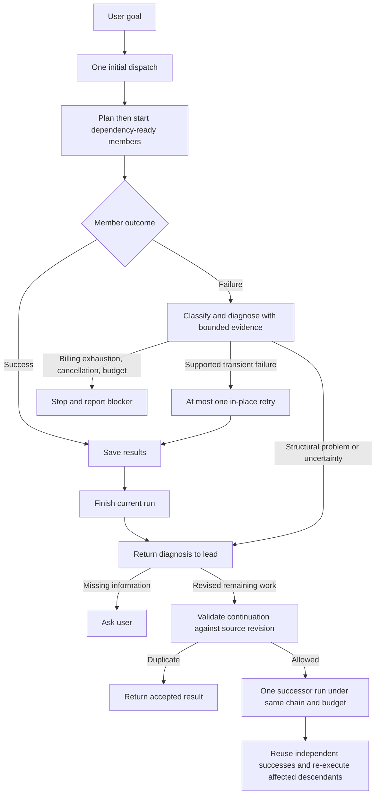

# Execution chains and failure recovery / 执行链与失败恢复

Version 1.2.0 keeps the initial per-message dispatch receipt and adds a separate,
lead-only `continue_squad_run` tool. One goal can have an initial run and **one**
reviewed continuation. New wording, member names, and model-chosen request ids do
not create new admission. The host allocates run ids and persists a successor
receipt before starting work.



## Diagnosis is advice, not execution authority

With `failurePolicy: retry-once`, failed members do not blindly replay a structural
failure. Explicit provider billing codes (`insufficient_quota`,
`billing_hard_limit_reached`, `credit_balance_too_low`, insufficient credits/balance)
stop before a diagnostic model call. HTTP 429 alone is not treated as exhausted
billing quota. Explicit startup DNS/connection-refusal errors with no returned child run may retry without a diagnostic model call. Mid-run disconnects and unknown errors still require assessment.

The system coordinator uses the lead's configured model route, a maximum 2,048
output tokens and a timeout no longer than 60 seconds (or the member timeout if
shorter). It receives bounded goal/role/assignment/dependency context, errors,
reported progress and available child-session evidence. It has no tools, enforced
both by the provider filter and an execution guard for marked in-process children.
It is not added to the member library or squad.

The coordinator returns evidence, uncertainty and a recommendation: transient
retry, revised remaining work, or stop. A structural revision **does not execute
automatically**; the lead receives it after the run settles. Invalid, unavailable,
cancelled or timed-out diagnosis never falls back to a blind retry. Timeout alone
does not establish that a task was too large. Classification is model advice, not
a guarantee that side effects are safe to repeat.

## Continuing a run

Use the `continuation` object in the result/guaranteed-mode notice. For example:

```json
{
  "sourceRunId": "<dispatchId from the settled run>",
  "expectedRevision": 0,
  "reason": "The worker reached the context limit after implementing the API.",
  "progressReview": "API changes were reported, not independently verified. Inspect those changes before editing; UI and tests remain.",
  "assignments": [
    {
      "agentId": "builder",
      "task": "Inspect and verify the existing API. Then implement the UI and tests in order, preserving the original acceptance criteria."
    }
  ]
}
```

- Source must belong to the calling lead session and current durable human message.
- Source must have settled as `failed` or `partial`, with a saved chain, plan and
  definition snapshot. Old runs without these snapshots cannot be continued.
- Every unfinished plan member needs an explicit remaining assignment. Member/task
  identities remain stable. Each existing member has one node; multiple new nodes
  for one member or a new squad are outside this version.
- Optional `dependsOn` edits must remain acyclic and respect configured fixed order.
  The original goal and acceptance criteria remain authoritative; semantic task
  correctness still depends on the lead's judgment.
- Independent successful tasks cannot be restarted, including by inventing a new
  dependency. Successful descendants of a failed task are invalidated conservatively,
  traversing both old and revised dependency graphs, and rerun with prior-work context.
- Continuation is rejected after cancellation, host interruption, known billing
  exhaustion, configured-budget exhaustion, changed team definitions, stale plan
  revision, or the one-continuation limit. A quality-only rejection with all member
  tasks completed requires user review rather than this recovery path.
- Equivalent duplicate submissions reuse the in-flight promise or durable result;
  a conflicting second submission cannot create another successor. A missing run
  after durable acceptance is reported for user review, never silently replayed.

## Usage, history and boundaries

Each run stores only its newly incurred usage. `chain.usageBeforeRun` carries prior
usage so the configured team budget is checked cumulatively; reused results do not
charge their old tokens again. Diagnosis has its own route/sample attribution.
The budget remains **soft**: it uses provider-reported usage, cannot count missing
samples as zero, and cannot prevent overshoot by already-running calls or parallel
members. Ordinary lead-conversation tokens are outside the plugin's accounting.
Without a configured team budget there is no aggregate Token cap; the continuation
count, per-attempt output limit where configured, and diagnosis limits still apply.
Each run may have at most one transient retry per member; the chain has at most two
runs, so retries cannot create an unbounded recovery loop.

Run Center shows chain id/revision, cumulative reported tokens, reused members,
diagnosis and first failure. Full prior output stays in the source run and recovery
record; list responses omit raw diagnostic evidence/first-attempt output. Original
plans are not overwritten. Restart marks in-flight diagnosis interrupted/failed;
it does not automatically resume side effects. Admission is durable and coordinated
within one plugin process, not a distributed exactly-once guarantee for tool effects.

The user-operated Run Center retry button remains an explicit replay/new run; it is
not exposed as a model bypass around chain limits. Diagnosis applies on failure when
that run's configured policy is `retry-once`.

简要说明：首次派工仍按用户消息防重复；主 Agent 在本轮结束后，通过专门入口提交剩余任务，
同一执行链最多继续一次。系统诊断只提供建议，不能自行决定结构性任务修订。独立成功成果
复用，受影响的下游重新验证；取消、额度、预算、版本与次数限制不能靠改写任务绕过。
