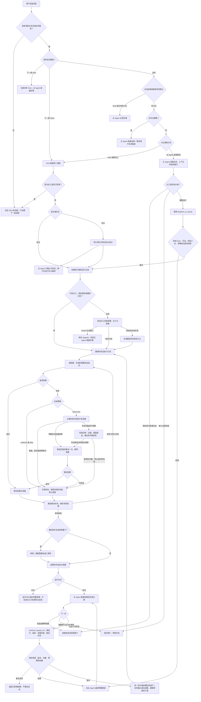

# 小队按需使用：完整流程与边界

本页描述 v1.3.0 的行为。设置 → 小队 → **小队使用方式**：

- **主 Agent 按需使用**：先进行主 Agent 原本就需要的推理。简单任务直接完成，缺少信息先询问，需要分工才调用小队。没有额外的路由 Agent。
- **Host 强制派工**：Host 先进入小队调度，随后遵循规划策略。Smart 可让规划器跳过；Manual 要求显式下一条 Team 或手动运行操作。

新建小队和内置模板默认按需使用；已保存或导入的配置保持原选择，旧记录缺少该字段时仍按原来的 guaranteed 解释。

## 审视后的规则

| 边界 | 行为 |
| --- | --- |
| 简单任务 | pre-step 不启动规划器或成员，也不创建运行记录/派工占用；模型仍须自行判断复杂度 |
| 已拒绝、已取消、子 Agent、无新用户文本 | Host 不自动派工，不消费下一条选择 |
| 仅下一条 Solo | 覆盖本轮小队默认，生成明确通知；工具调用也被程序拒绝 |
| 持久 Solo | 模型不能通过全局工具绕过；显式下一条 Team 仍可覆盖一次 |
| 仅手动 | 普通消息不能自动派工，也不能被模型调用小队绕过；使用下一条 Team 或手动运行操作 |
| 换一个 squadId | 有生效小队时，模型不能悄悄派给另一支小队 |
| Adaptive/DAG | 派工时省略 assignments/memberOrder 才走自动规划；显式分工和固定顺序绕过规划器 |
| 固定顺序 | 实际执行全部配置成员；界面显示有效选人方式，不再把智能跳过当成仍然有效 |
| 智能跳过 | 发生在真正进入调度后的规划阶段，已经消耗规划调用；同一消息不能再首次派工 |
| 后台 | 模型工具路径等待结果；后台仅用于 Host 路径，界面显示这个有效限制 |
| 配置更新 | 保存可持久化，撤销不会覆盖原配置；旧记录、复制、导入保留各自选择 |
| 失败继续 | 主 Agent 决定修订；同一消息、同一执行链最多继续一次，沿用原软预算与防重复收据 |
| 失败不等于没做 | 继续任务携带旧产物与进展；独立成功任务复用，受影响下游重新验证 |

模型的复杂度判断是提示词引导，不是数学保证。测试能确认 Host 不抢先派工、工具边界有效、
配置与提示词一致，不能证明所有模型都永远不把简单任务派给小队。

当前继续能力仍保留每个成员一个任务节点；需要用户补充信息时结束自动推进，后续新用户
消息走新的请求处理。后台运行不会自动替换已经发出的主 Agent 回复。普通主 Agent 推理
用量不计入插件运行统计，团队预算基于已报告用量，是软限制。
